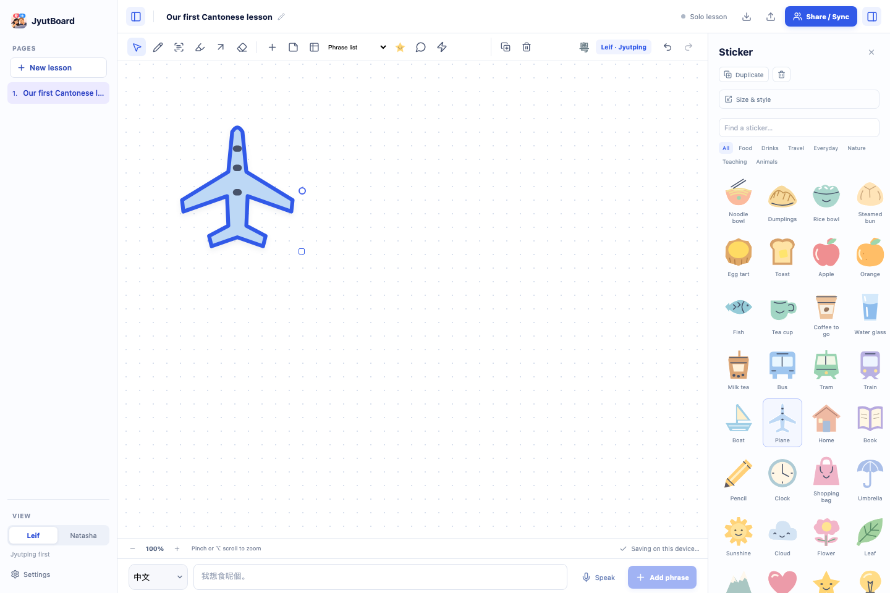
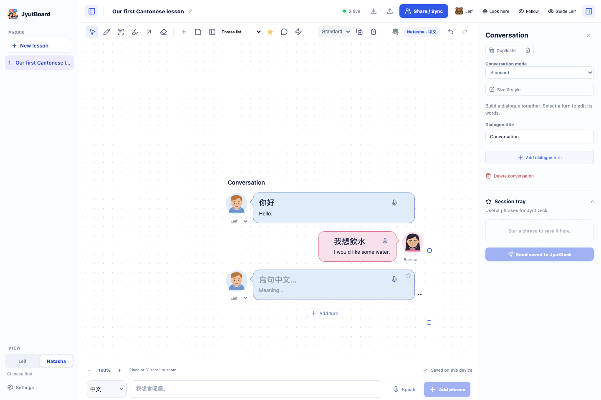

# JyutBoard

A live teaching canvas for learning Cantonese together. Natasha writes naturally in Chinese; Leif sees Jyutping first. Both views share movable phrase cards, dense phrase tables, notes, drawings, pronunciation recordings, and a session tray.

**[Download JyutBoard](https://jyutboard.vercel.app/download.html)** · [Mac · Apple silicon](https://github.com/lemaurer/jyutboard/releases/latest/download/JyutBoard-Mac-Apple-Silicon.dmg) · [Mac · Intel](https://github.com/lemaurer/jyutboard/releases/latest/download/JyutBoard-Mac-Intel.dmg) · [Windows installer](https://github.com/lemaurer/jyutboard/releases/latest/download/JyutBoard-Setup.exe)

Install once: Mac → drag into Applications; Windows → run the installer. Desktop updates are downloaded automatically from this repository’s GitHub Releases, verified against the release checksum, and installed in place when you quit. A **Restart to update** button lets you install sooner; it is unavailable during a live lesson. Settings offers **Check for updates** and an automatic-download preference. Lessons, pairings and encrypted credentials remain in your existing user-data folder. The iPad PWA updates after it closes and reopens.

The portable Windows build is available on the Releases page; use the installer for the automatic-update experience.


## Start a lesson

1. Choose **Natasha** or **Leif** in the left panel. The view is local to each computer. Chinese leads on Natasha’s screen; Jyutping leads on Leif’s. Hide either side panel with its button in the top bar whenever you want more canvas.
2. Choose Chinese, Jyutping, or English to the left of the bottom text field. All three create the same complete Cantonese phrase card with Chinese, Jyutping and English. Common phrases convert offline; other English or Jyutping inputs use JyutDeck’s analysis through your configured desktop or paired Internet lesson. If conversion fails, the input is kept for retry. Chinese readings appear immediately, with English translation enriched in the background.
3. Click a card for word division, recording, or its session tray star. Natasha chooses **Standard**, **Compact**, or **Practice** in the selected-card toolbar. Standard shows the phrase and English, with small Chinese on Leif’s view. Compact reveals English on hover or tap; Practice shows just the phrase. Cards are transparent by default, with quiet fill presets in Card appearance. The **粵** toolbar switch colours words from the actual JyutDeck vocabulary: muted green for known, amber for queued, rose for new, grey for unchecked. Verified statuses are read-only in the word editor; change them in JyutDeck. Embedded notes appear in Standard mode. No separate English-visibility switch or expand button is needed.
4. Star useful phrases and send them to JyutDeck’s Natasha approval queue. JyutDeck analyses the original Cantonese and handles its own word breakdown. Audio stays on the lesson card because the request API does not accept recordings.

Click the table icon to add a compact phrase table. Its neighbouring dropdown offers Phrase list (default), Vocabulary, Patterns, Question/answer and Comparison. Paired tables automatically derive both Cantonese readings. The inspector offers Minimal (default), Ruled and Soft rows. Natasha enters Chinese; Leif sees Jyutping in that column. English is suggested automatically, and translations and notes are editable in each row. Choose Practice in the selected-card toolbar to hide English. Select a row for its word breakdown.

The canvas starts in the middle of a 5600 × 3600 desk. Double-click empty space or select the phrase tool and click a spot to create a card there. Place sticky notes or stickers the same way. Highlight, pen and arrow tools help explain ideas visually. Drag a phrase card anywhere on its body, or drag tables from their top edge. **⌘Z / Ctrl+Z** undoes your own changes; **⇧⌘Z / Ctrl+Shift+Z** redoes them, preserving your partner’s edits. Select an item and press **Delete** or **Backspace** to remove it; text fields keep their normal editing keys. Pinch the trackpad or hold **Option** while scrolling to zoom in or out around the pointer. Normal two-finger scrolling pans the canvas. Trackpad pinch finishes with a short, decaying glide; touching the canvas or starting another gesture stops it. Camera movement uses a single compositor transform, with scroll geometry reconciled after the gesture, so cards and ink stay together. The white canvas has a muted surrounding desk: dragging past an edge progressively resists movement and springs gently back. The allowed overscroll adapts to zoom and viewport size. The zoom buttons work too. Lessons and audio are saved on the device. The left sidebar provides a simple list of lessons. Export a lesson backup before changing computers; importing makes a separate copy. The details panel starts closed and opens only through the top-right details button. Selecting cards never opens it automatically.

## Canvas tools

The sticker library contains 36 original illustrations in seven categories, with search. Stickers respond to clicks on the artwork, and their selection border follows the silhouette. Choose a sticker, then click the canvas to place it; no emoji fonts are needed.

Drag across empty canvas to select several elements, or Shift-click to add/remove individual elements. Move the selection together; the right panel offers shared card modes, shapes, backgrounds, text sizing, alignment, duplication and deletion where applicable. **⌘A / Ctrl+A** selects the whole canvas; **Escape** clears selection. Text fields retain normal selection shortcuts.

Drag the selected element’s corner to resize, or open **Size & style** for exact dimensions. Stickers keep their proportions; hold Shift to preserve proportions when resizing other elements. Drag the small blue connection dot on the edge of any element to another element. The arrow stays attached as either element moves or resizes. Connectors can be selected and deleted like drawings, and are included in lesson backups and live sync.

Pen, marker and free arrows have simple colour and thickness controls. Select a drawn line to move, recolour or delete it. The eraser removes complete strokes as you brush over them, and undo restores them.



## Conversations and speaking

Choose the conversation icon for a lightweight dialogue on the canvas. Add turns repeatedly, write Cantonese in each bubble, and edit translations directly; notes stay in the details panel. Natasha and Leif are the default speakers; choose Friend, Teacher or a custom name. Leif sees Jyutping in the same bubbles. Person stickers and speech-bubble phrase cards let you arrange freeform conversations too. Double-click a phrase to edit it in place; new blank cards open their editor automatically. A small star appears beside the card on hover; there is no hover header or mode label.

Natasha can hold **Hold to speak** beside the bottom input, say a Cantonese phrase, then release. The exact recording is transcribed by JyutDeck’s existing Cantonese transcription provider and attached to the new card. If transcription fails, retry the saved clip or keep it and type the phrase. The microphone is limited to 60 seconds / 2 MB. Only this explicitly recorded audio is sent for transcription.

The laser tool draws a temporary live trail for both partners that fades after 1.8 seconds and is never saved. The eraser removes saved strokes and supports undo.



## Live sharing

- **Same Wi-Fi:** open the lesson on the host computer, choose **Share / Sync**, and create an invitation. The app hosts a small relay on port **47831** and shows a private `jyutboard://` invite containing the high-entropy room code. Send the invite to the other person. Keep JyutBoard open on the host computer. If the network blocks Wi-Fi device traffic, allow JyutBoard through the local firewall.
- **Different Wi-Fi networks:** choose **Share / Sync → Start internet lesson** on either desktop. Copy the private invitation to your partner, who pastes it into **Lesson invitation → Join lesson**. No account, router settings or relay address needed. Internet hosting also remembers a pairing through JyutDeck. The host’s request token is required once; the guest only pastes the first invitation. Keep the host app open. The bundled, checksum-verified cloudflared binary starts a temporary WSS connection to the host’s relay. After the first invitation, choose **Open our room** on the host and **Join Leif / Join Natasha** on the guest. The pairing privately resolves the new relay address after host restarts. The host must have opened the room before the guest joins. The room capability is kept in OS-encrypted settings and can be removed with Forget pairing. Paired guests can fetch vocabulary and transcribe without an API token; desktop queue submission uses its external request token; paired iPad/web clients submit through the room capability without receiving that token. [Cloudflare Quick Tunnels](https://developers.cloudflare.com/tunnel/get-started/quick-tunnels/) are intended for testing and have no uptime guarantee. This is the MVP’s remote hosting option; use your own stable WSS relay below for a permanent room.

Natasha’s cursor is a raccoon 🦝, Leif’s a bear 🐻. Click the partner’s name to find their cursor and jump there. **Look here** brings the partner to your spot with a visual pulse on the cursor, without a message banner. **Follow** follows the partner’s view; Natasha’s **Guide Leif** starts a presenter view that follows her panning and zoom. Leif can stop following at any time. The app sends small document changes, batches rapid edits within 16 milliseconds, and interpolates remote cursors. Dragging uses a frame-aligned visual preview and commits the shared position on release. Pinch zoom updates the canvas directly rather than rebuilding every card on each touch event. Attached arrows follow their endpoints continuously during the drag preview. Encrypted DNS with a system fallback avoids fresh-room address lookup delays.

The included relay keeps active lesson data in memory and forgets idle rooms after an hour. It supports up to 8 people per room, 20 MB per room and 100 active rooms per relay.

Anyone holding the invite can edit the room. The relay operator can read the lesson. Plain `ws://` traffic is unencrypted: use it only on a trusted local network or private VPN. For internet access, use WSS. The app bounds recordings to 2 MB per phrase and rooms to 20 MB.

## JyutDeck setup

Open **Settings** and enter the one-time `NATASHA_REQUEST_API_TOKEN` made for the existing JyutDeck request API. The app stores it with the computer’s OS encryption; it is sent only from the desktop main process to the HTTPS API. Never place it in an invite, a lesson note, or the repository. Configure the token on each computer from your own secret store. Leave the endpoint set to `https://jyutdeck-live-jul08f.vercel.app/api/v1/requests` unless you intentionally run another endpoint.

The app sends the chosen Chinese, English, or Jyutping source, a note with the session title and card note, stable retry keys and small source metadata. The API analyses each request and saves it for Natasha to review. Results stay on each card, including duplicates and individual failures; retrying an unchanged phrase is safe. Desktop queue sending requires its saved API token. Paired iPad/web participants use the host’s registered lesson capability. Local lessons continue to work when the queue is unavailable.

## Translation and language data

Jyutping and the 231,000-entry Chinese/Jyutping dictionary work offline. The included `to-jyutping` package supplies character-level readings when an exact word reading is missing. Some characters have more than one Cantonese reading; edit a phrase’s Jyutping and word breakdown whenever the dictionary needs help. The frequent conversational phrases have a small curated translation layer.

Online English translation is enabled by default and uses Google’s free translation endpoint from the desktop process. In Settings, disable it to keep new lesson text local, or enter a Google Cloud Translation API key for the supported authenticated service. Online English translations are machine suggestions and can be corrected. No lesson audio is sent for English translation. Push-to-talk deliberately sends the captured clip for Cantonese transcription.

## Run from source

You need Node.js 22+ and npm.

```sh
npm install
npm run prepare:remote # once, for internet hosting from the development app
npm run dev
```

### Build locally

```sh
npm run check
npm run pack
```

`npm run pack` creates a packaged, unpacked test build in `release/`.

On macOS:

```sh
npm run dist:mac
```

Builds a `.dmg` and `.zip` for the Mac computer doing the build. Open `release/` and move JyutBoard into Applications. These community test builds are not Apple notarized. macOS may ask you to confirm the first launch in **System Settings → Privacy & Security**.

On Windows PowerShell:

```powershell
npm install
npm run check
npm run dist:win
```

The Windows installer and portable build appear in `release/` as `JyutBoard-Setup.exe` and `JyutBoard-Portable.exe`. GitHub Actions builds Mac and Windows packages separately. Create a version tag such as `v0.5.2` to publish them on the GitHub Releases page; the README's Windows button then always points directly to the latest installer. CI builds are not code signed. Windows SmartScreen may require **More info → Run anyway**.

## Relay on a small Linux host

The relay requires Node.js 22. Build the app first, then run the public `relay` script on a host you control:

```sh
npm install
npm run build
PORT=47831 npm run relay
```

Only expose the relay through a reverse proxy with TLS. Example Caddy site:

```caddyfile
relay.example.com {
    reverse_proxy 127.0.0.1:47831
}
```

Use `wss://relay.example.com` when creating invitations. The relay does not write room text or audio to disk. Put it behind your operating-system service manager and firewall; keep the listening port private from the public network.

## Tests and security

```sh
npm test
npm run build
npm run test:e2e
# Optional: starts a temporary public tunnel with synthetic test data
npm run test:remote
# Optional: test two packaged desktop apps across the internet
node scripts/test-desktop.mjs /path/to/JyutBoard/executable
```

Electron uses an isolated, sandboxed renderer with a narrow validated IPC bridge. Queue credentials use macOS Keychain / Windows DPAPI via Electron `safeStorage`. Link navigation, new windows and unexpected permissions are blocked. The room code is a 192-bit capability; share an invitation only with someone who should be able to edit that lesson.

Report bugs through GitHub Issues. Please do not post API tokens or private lesson recordings.

## Contributing

Issues and small focused pull requests are welcome. Please do not attach private lesson data or secrets to issues. `npm run check` runs the offline language, request-shaping, local undo, reconnect, and relay-isolation tests followed by the production build. `npm run test:e2e` checks two-screen teaching, hover/hidden meanings, split/merge word pieces, tables, temporary panels, cursor attention, camera following, silhouette sticker selection, transparent cards, attached connectors, group edits, resizing, drawing selection and erasing.

### Cleaner conversations and speech capture

Double-click a sticky note to edit it directly. Conversation bubbles can each be starred into the session tray, sent to JyutDeck, recorded, and given their own display mode from the small options menu. Pick from twelve illustrated avatars by clicking the person's portrait. English can be hidden for the whole conversation or an individual bubble. Notes stay in the details panel.

The microphone sits beside the text field on the same row. Language selection stays below. The microphone supports holding to speak or clicking once to start and again to stop. A release during the permission prompt keeps recording until you stop it; failed transcription keeps the clip available for retry or manual text. The laser draws over every canvas element without selecting or editing it. Vocabulary colours are off by default and do not change on hover.

## iPad · JyutBoard on your Home Screen

Open **https://jyutboard.vercel.app/** in Safari, then **Share → Add to Home Screen**. Choose **Natasha · 中文** or **Leif · Jyutping**. On the Mac/Windows host, open **Share / Sync → Start internet lesson → Copy iPad link**. Open that private link on the iPad once; future lessons use **Share / Sync → Join Leif / Join Natasha**. Keep the host desktop app open. If its connection restarts, open the paired room on the desktop; the iPad resolves its new address automatically.

[Safari’s installation behaviour](https://webkit.org/blog/14787/webkit-features-in-safari-17-2/) copies a secure, host-only pairing cookie into the newly installed Home Screen app. JyutBoard restores that room and retrieves the desktop’s current relay; no second invitation paste is needed. The web client shares the same lesson, recordings, vocabulary, session tray and queue. It never needs the desktop API token. Lessons remain in this device’s browser storage for offline editing and reconnect when the host is available. Export important lessons as backups; uninstalling the web app or clearing Safari storage can remove local data.

**Pencil and touch:** Pencil draws pressure-sensitive ink with the Draw/Highlight tools. A finger pans while those tools are active; two fingers pan and pinch to zoom with any tool. Use the Lasso to circle cards and ink. Tap an object to select it, then drag the selection directly—even with the Pencil tool active. Two fingers always pan and zoom. Tap empty canvas to deselect. Double-tap a phrase or note to edit it in place; use the corner to resize. Finger panning glides to a gentle stop on release; touching the canvas again stops the glide immediately. Pan is available for browsing without selecting anything. Tap a compact card to reveal its meaning; the toolbar pencil is also available to edit text. Advanced appearance and word division stay in the details panel, which opens only with the top-right button. The keyboard-aware layout follows Safari’s visible screen size and offset; the input language row is omitted on iPad; Chinese, tone-number Jyutping and English are recognized in either view.

**Three card modes:** Standard shows the phrase and English (with small Chinese for Leif). Compact shows the phrase, with English on hover/tap. Practice shows the phrase only. Phrase fills default to transparent; choose a preset in Card appearance. Conversation bubbles default to soft blue/pink fills; their stars go into the same session tray as phrase cards, with one shared send action. The toolbar **粵** switch colours known, queued and new words with muted colours from JyutDeck.

**Updates:** New web versions download automatically and activate when the open lesson is closed and reopened. They never force a reload while drawing or recording. No App Store is needed. Microphone access requires HTTPS and permission in Safari; tap to start/stop or hold push-to-talk. The exact clip stays attached to the phrase, including when transcription fails and you choose to type it instead.

### Web development and deployment

`npm run dev:web` starts Vite. `npm run build:web` builds `dist/`, the Home Screen manifest and a versioned offline service worker. `npm run build` also builds Electron. `npm run test:e2e` checks desktop interactions, iPad WebKit input, collaboration and production offline/update behaviour. Install both browser engines first with `npx playwright install chromium webkit`.

Vercel builds this repository with `vercel.json` and publishes the `main` branch. `/api/board` proxies to the existing JyutDeck board API over HTTPS; no credentials are bundled in the web client. The host registers its room with the existing API token. Browser vocabulary, transcription and bounded queue submission are authorized by that private 192-bit room invitation. Queue requests reuse JyutDeck’s validated, idempotent external request handler. The relay still runs on the desktop and uses its existing Internet tunnel; the iPad is a participant, not a host. Invite links grant editing and queue access to whoever holds them—share them only with lesson participants.

Apple Pencil pressure, coalesced events, palm rejection and gestures are exercised with synthetic pointer events in WebKit. Physical iPad/Pencil feel should still be checked on the actual device; browser hardware APIs cannot guarantee every native GoodNotes feature.

### Content-sized cards and dialogue input

New phrase cards fit their visible content. Standard shows language and English, Compact reveals English on hover/tap, and Practice shows language only. Favourites sit inside the card with reserved space; right-hand dialogue bubbles put the star on the left. Border thickness, colour and line style are editable in **Card appearance**. On wide canvases, Border and Fit to text are available directly in the selection toolbar. Manual resizing remains available.

Both participants can enter Chinese, English or tone-number Jyutping at the bottom or in place; completing an edit fills the same three language fields. Dialogue turns have their own microphone control, and attach the exact recorded clip to that turn. Editing an English dialogue meaning fills Cantonese and Jyutping on leaving the field. Starred dialogue turns share the normal session tray and JyutDeck send action. On a joined iPad, connection controls move from the top bar to **Lesson connection** in the page sidebar.

### Quiet editing and participant views

Leif’s canvas uses Jyutping without secondary Chinese on phrase cards or dialogue bubbles. Conversation audio controls are Natasha-only: the microphone sits beside the Chinese text and becomes a playback icon after recording. Bubble colours follow their avatar, and the vocabulary switch highlights dialogue words as well as phrase words. Double-click language text or a Standard card meaning to edit it directly on the canvas; a single click only selects. Editing uses the same typography and word colours as the displayed phrase.

Placement hints overlay the canvas without moving the view. The empty-canvas welcome can be dismissed with its close button and stays out of drawing tools. New sticky notes start empty, with placeholder text. Move tables from any non-text area or the small grip beside their title; table fill presets and border controls are available in appearance settings.

### Canvas gesture routing

Idle card and dialogue text stays ordinary canvas text, without invisible input overlays. Double-click or double-tap opens the chosen language or meaning editor; finishing closes it again. Scrolling over language, meaning and table fields uses the canvas camera, except when a focused multiline note editor needs its own internal scrolling. Pinch zoom, momentum and elastic boundaries continue to use the shared camera.

### Handwrite → Card

Choose **Handwrite → Card** beside Pen. Write Chinese with Apple Pencil (or a mouse on desktop), then pause for about a second. Nearby strokes become one phrase preview. **Confirm** replaces the temporary ink with a normal card at the same position, including Jyutping, English and the usual vocabulary awareness. Use **Edit**, **Retry** or **Cancel** in the preview if needed. Recognition requires Internet access and a registered paired lesson, or the host's JyutDeck request token. Failed recognition keeps the ink available for manual correction.

Handwrite and Pen are separate. Pen drawings are never recognized or converted. Unconfirmed handwriting is temporary and local to the writer; confirmed cards use the existing shared lesson and persistence. Fingers still pan and pinch while Pencil writes. Conversation text opens for editing with one click/tap; on iPad, panning or zooming finishes the active edit before moving the canvas so Safari's native caret cannot stay behind.

The recognition function source lives in `server/handwriting-recognition.ts` and `services/handwrite/handler.ts`. It validates a bounded PNG crop and verifies the existing lesson capability before calling the server-side vision provider. No provider key enters the app or shared document. The deployed function uses the existing lesson project's sensitive credential in an isolated deployment; JyutDeck's production application remains unchanged. `node scripts/deploy-recognition.mjs` verifies that project, deploys only the recognition service with automatic alias promotion disabled, and updates JyutBoard's rewrite to its immutable URL. Deploy the JyutBoard web app afterwards. An independently configured service can use `OPENAI_API_KEY` or `GROQ_API_KEY`, plus optional `HANDWRITE_MODEL`.
