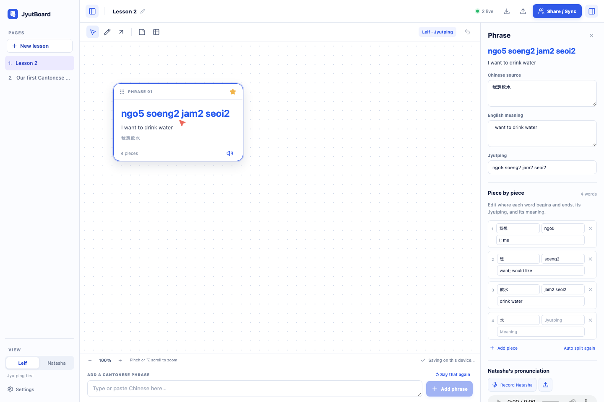

# JyutBoard

A live teaching canvas for learning Cantonese together. Natasha writes naturally in Chinese; Leif sees Jyutping first. Both views share movable phrase cards, dense phrase tables, notes, drawings, pronunciation recordings, and a session tray.

**[Download for Mac](../../releases/latest)** · Windows installers are available in each GitHub Actions build and in tagged releases.



## Start a lesson

1. Choose **Natasha** or **Leif** in the left panel. The view is local to each computer. Chinese leads on Natasha’s screen; Jyutping leads on Leif’s. Hide either side panel with its button in the top bar whenever you want more canvas.
2. Type a Chinese phrase or paste one. Jyutping and word meanings appear immediately from the bundled offline dictionary. English translation runs in the background while online translation is enabled.
3. Click a card to edit the phrase and its **Piece by piece** word division, record or attach Natasha’s pronunciation, or save it to the session tray. Natasha can choose a rounded, sheet, or sticky shape and switch the card between **Full**, **Compact**, and **Practice** modes. Practice hides English throughout Leif’s card and details view until Natasha switches it back.
4. Star useful phrases and send them to JyutDeck’s Natasha approval queue. JyutDeck analyses the original Cantonese and handles its own word breakdown. Audio stays on the lesson card because the request API does not accept recordings.

Click the table icon to add a compact phrase table. Natasha enters Chinese; Leif sees Jyutping in that column. English is suggested automatically, and translations and notes are editable in each row. Natasha can hide the table’s English column from Leif. Select a row for its word breakdown.

Drag a card or table from its top edge. Select an item and press **Delete** or **Backspace** to remove it; text fields keep their normal editing keys. Pinch the trackpad or hold **Option** while scrolling to zoom in or out around the pointer. Normal two-finger scrolling pans the canvas. The zoom buttons work too. Lessons and audio are saved on the device. Export a lesson backup before changing computers; importing makes a separate copy. The learner can click **Say that again** to send Natasha a quick in-room signal.

## Live sharing

- **Same Wi-Fi:** open the lesson on the host computer, choose **Share / Sync**, and create an invitation. The app hosts a small relay on port **47831** and shows a private `jyutboard://` invite containing the high-entropy room code. Send the invite to the other person. Keep JyutBoard open on the host computer. If the network blocks Wi-Fi device traffic, allow JyutBoard through the local firewall.
- **Over the internet:** deploy the optional relay below behind a TLS reverse proxy and use its `wss://` address in Share / Sync, or connect the computers with a trusted private VPN and use its private `ws://` address. The included relay keeps active lesson data in memory and forgets idle rooms after an hour. It is deliberately small: up to 8 people per room, 20 MB per room and 100 active rooms per relay.

Anyone holding the invite can edit the room. The relay operator can read the lesson. Plain `ws://` traffic is unencrypted: use it only on a trusted local network or private VPN. For internet access, use WSS. The app bounds recordings to 2 MB per phrase and rooms to 20 MB.

## JyutDeck setup

Open **Settings** and enter the one-time `NATASHA_REQUEST_API_TOKEN` made for the existing JyutDeck request API. The app stores it with the computer’s OS encryption; it is sent only from the desktop main process to the HTTPS API. Never place it in an invite, a lesson note, or the repository. Configure the token on each computer from your own secret store. Leave the endpoint set to `https://jyutdeck.vercel.app/api/v1/requests` unless you intentionally run another endpoint.

The app sends only Chinese text, a note with the session title, stable retry keys and small source metadata. The API analyses each request and saves it for Natasha to review. Results stay on each card, including duplicates and individual failures; retrying an unchanged phrase is safe. No API token means local lessons continue to work, but queue sending is disabled.

## Translation and language data

Jyutping and the 231,000-entry Chinese/Jyutping dictionary work offline. The included `to-jyutping` package supplies character-level readings when an exact word reading is missing. Some characters have more than one Cantonese reading; edit a phrase’s Jyutping and word breakdown whenever the dictionary needs help. The frequent conversational phrases have a small curated translation layer.

Online English translation is enabled by default and uses Google’s free translation endpoint from the desktop process. In Settings, disable it to keep new lesson text local, or enter a Google Cloud Translation API key for the supported authenticated service. Online English translations are machine suggestions and can be corrected. No lesson audio is sent for translation.

## Run from source

You need Node.js 22+ and npm.

```sh
npm install
npm run dev
```

### Build locally

```sh
npm run check
npm run pack
```

`npm run pack` creates a packaged, unpacked test build in `release/`.

On macOS:

```sh
npm run dist:mac
```

Builds a `.dmg` and `.zip` for the Mac computer doing the build. Open `release/` and move JyutBoard into Applications. These community test builds are not Apple notarized. macOS may ask you to confirm the first launch in **System Settings → Privacy & Security**.

On Windows PowerShell:

```powershell
npm install
npm run check
npm run dist:win
```

The Windows installer and portable build appear in `release/`. GitHub Actions builds Mac and Windows packages separately. Create a version tag such as `v0.2.0` to publish downloadable installers on the GitHub Releases page. CI builds are not code signed. Windows SmartScreen may require **More info → Run anyway**.

## Relay on a small Linux host

The relay requires Node.js 22. Build the app first, then run the public `relay` script on a host you control:

```sh
npm install
npm run build
PORT=47831 npm run relay
```

Only expose the relay through a reverse proxy with TLS. Example Caddy site:

```caddyfile
relay.example.com {
    reverse_proxy 127.0.0.1:47831
}
```

Use `wss://relay.example.com` when creating invitations. The relay does not write room text or audio to disk. Put it behind your operating-system service manager and firewall; keep the listening port private from the public network.

## Tests and security

```sh
npm test
npm run build
```

Electron uses an isolated, sandboxed renderer with a narrow validated IPC bridge. Queue credentials use macOS Keychain / Windows DPAPI via Electron `safeStorage`. Link navigation, new windows and unexpected permissions are blocked. The room code is a 192-bit capability; share an invitation only with someone who should be able to edit that lesson.

Report bugs through GitHub Issues. Please do not post API tokens or private lesson recordings.

## Contributing

Issues and small focused pull requests are welcome. Please do not attach private lesson data or secrets to issues. `npm run check` runs the offline language, request-shaping, reconnect, relay-isolation, and two-screen lesson tests followed by the production build.
